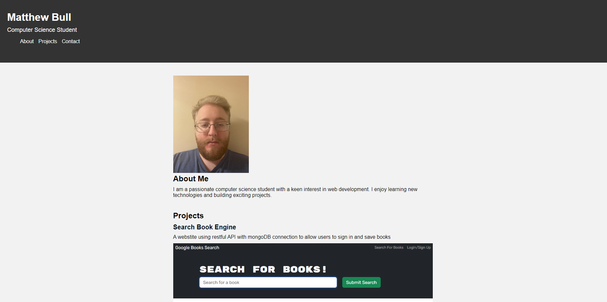

# Module-2-Challenge

## Description

My motivation for the project was to apply skills I learned to make a portfolio.
This helped me learn the basics of css styling and to give me a baseline to work on a fancier portfolio later

## Installation

N/A

## Usage

https://matt-bull1.github.io/My-Portfolio/